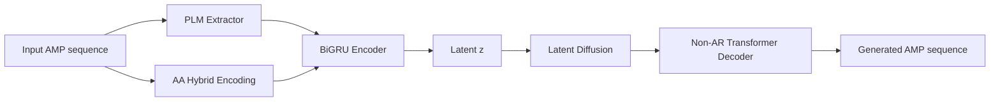

[English](./README.md) | [简体中文](./README.zh-CN.md)

<p align="center">
  
</p>

# AMP Forge

[](./esm_diffvae/requirements.txt)
[](./frontend/package.json)
[](./frontend/package.json)
[](https://unumbrela.github.io/amp-research2/)

AMP Forge is an antimicrobial peptide (AMP) generation project focused on a practical and extensible workflow for:

- de novo AMP generation,
- controlled variant design from parent sequences,
- model training and evaluation with reproducible scripts.

## Live Demo

- Project page: [https://unumbrela.github.io/amp-research2/](https://unumbrela.github.io/amp-research2/)

## Quick Links

- Project summary: [PROJECT_SUMMARY.md](./PROJECT_SUMMARY.md)
- Data collection report: [DATA_COLLECTION_REPORT.md](./DATA_COLLECTION_REPORT.md)
- Core model package: [esm_diffvae/](./esm_diffvae)
- Frontend package: [frontend/](./frontend)

## Key Features

- Unified architecture: PLM embeddings + VAE + latent diffusion.
- Non-autoregressive decoding for parallel sequence generation.
- Conditional variant modes: `mixed`, `c_sub`, `c_ext`, `c_trunc`, `tag`, `latent`.
- End-to-end scripts for data prep, training, generation, and evaluation.

## Example Results Snapshot

From a local evaluation run (`n=500` unconditional samples):

| Metric | Value |
|---|---:|
| Uniqueness rate | 1.00 |
| Novelty rate | 1.00 |
| Mean length | 25.54 |
| Mean diversity | 0.853 |

Reference output: `esm_diffvae/results/evaluation/evaluation_results.json`

## Architecture



## Repository Structure

```text
.
├── esm_diffvae/            # Core model, data, training, generation, evaluation
├── frontend/               # GitHub Pages frontend
├── PROJECT_SUMMARY.md      # Detailed technical summary
├── DATA_COLLECTION_REPORT.md
└── docs/                   # Bilingual docs and assets
```

## Getting Started

### 1) Core Environment

```bash
cd esm_diffvae
pip install -r requirements.txt
```

### 2) Data Pipeline (Optional if processed data already exists)

```bash
cd esm_diffvae
python data/crawl/parse_local_sources.py
python data/crawl/crawl_dramp.py
python data/crawl/crawl_uniprot.py
python data/crawl/merge_and_clean.py
python data/compute_embeddings.py --backend prot_t5 --model prot_t5_xl_half
```

### 3) Training Pipeline

```bash
cd esm_diffvae
python training/train_vae.py --config configs/default.yaml
python training/train_vae_rl.py --config configs/default.yaml --vae-checkpoint checkpoints/vae_best.pt
python training/train_diffusion.py --config configs/default.yaml --vae-checkpoint checkpoints/vae_best_recon.pt
```

### 4) Generation

Unconditional generation:

```bash
cd esm_diffvae
python generation/unconditional.py \
  --config configs/default.yaml \
  --checkpoint checkpoints/esm_diffvae_full.pt \
  --n-samples 100 \
  --top-p 0.9
```

Variant generation:

```bash
cd esm_diffvae
python generation/variant.py \
  --config configs/default.yaml \
  --checkpoint checkpoints/esm_diffvae_full.pt \
  --input-sequence "GIGKFLHSAKKFGKAFVGEIMNS" \
  --mode mixed \
  --n-variants 50
```

Latent interpolation:

```bash
cd esm_diffvae
python generation/interpolation.py \
  --config configs/default.yaml \
  --checkpoint checkpoints/esm_diffvae_full.pt \
  --seq-a "GIGKFLHSAKKFGKAFVGEIMNS" \
  --seq-b "ILPWKWPWWPWRR" \
  --n-steps 10
```

### 5) Evaluation

```bash
cd esm_diffvae
python evaluation/run_evaluation.py \
  --config configs/default.yaml \
  --checkpoint checkpoints/esm_diffvae_full.pt
```

### 6) Frontend

```bash
cd frontend
pnpm install
pnpm dev
```

## Extended Docs

- EN: [docs/en/quickstart.md](./docs/en/quickstart.md)
- EN: [docs/en/training.md](./docs/en/training.md)
- EN: [docs/en/generation.md](./docs/en/generation.md)
- EN: [docs/en/evaluation.md](./docs/en/evaluation.md)
- EN: [docs/en/data-pipeline.md](./docs/en/data-pipeline.md)

## Model Weights and Large Artifacts

Large artifacts are intentionally excluded from Git tracking (checkpoints, processed data, embeddings, results, etc.).

- Use GitHub Releases or external object storage for weight sharing.
- Use [scripts/check_large_files.sh](./scripts/check_large_files.sh) before pushing if needed:

```bash
bash scripts/check_large_files.sh
```

## Contributing and Security

- Contribution guide: [CONTRIBUTING.md](./CONTRIBUTING.md)
- Security policy: [SECURITY.md](./SECURITY.md)
- Code of conduct: [CODE_OF_CONDUCT.md](./CODE_OF_CONDUCT.md)
- Citation metadata: [CITATION.cff](./CITATION.cff)
