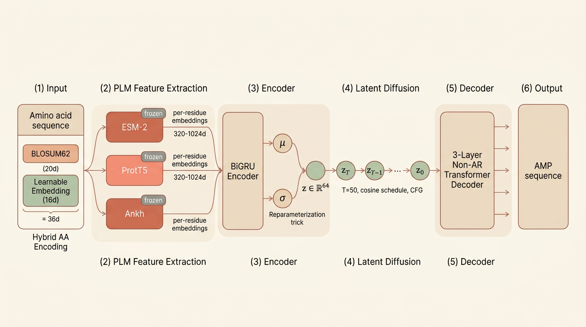

[English](./README.md) | [简体中文](./README.zh-CN.md)

<p align="center">
  
</p>

# AMP Forge

[](./esm_diffvae/requirements.txt)
[](./frontend/package.json)
[](./frontend/package.json)
[](https://unumbrela.github.io/AMP-Forge/)

AMP Forge 是一个基于 **Transformer VAE + 潜空间扩散模型 (Latent Diffusion Model)** 联合架构的抗菌肽 (AMP) 从头设计平台。系统利用预训练蛋白质语言模型（ESM-2 / ProtT5 / Ankh）提取序列级深层表征，经 BiGRU 编码器压缩至低维潜在空间，再通过潜空间扩散过程与非自回归 Transformer 解码器实现并行序列生成。平台提供混合 (`mixed`)、C 端替换 (`c_sub`)、C 端延伸 (`c_ext`)、C 端截断重建 (`c_trunc`)、标签引导 (`tag`) 及潜空间扰动 (`latent`) 共 6 种条件生成模式，实现对抗菌肽序列变体的精准可控设计。

## 在线演示

| | |
|---|---|
| **仓库地址** | [github.com/unumbrela/AMP-Forge](https://github.com/unumbrela/AMP-Forge) |
| **项目页面** | [unumbrela.github.io/AMP-Forge](https://unumbrela.github.io/AMP-Forge/) |
| **文档** | [PROJECT_SUMMARY.md](./PROJECT_SUMMARY.md) · [DATA_COLLECTION_REPORT.md](./DATA_COLLECTION_REPORT.md) |

## 核心特性

- **多 PLM 后端** — ESM-2、ProtT5、Ankh 统一接口；预计算 embedding 避免训练时瓶颈。
- **潜空间扩散生成** — 64 维潜空间中 50 步高斯扩散 + 无分类器引导 (CFG)，兼顾采样多样性与质量。
- **非自回归解码** — 并行预测全部残基位点，消除曝光偏差与误差累积。
- **6 种条件变体模式** — C 端替换 / 延伸 / 截断重建、标签引导、潜空间扰动、混合随机采样。
- **三阶段训练流程** — VAE MLE 预训练 → RL 对抗微调 → 潜空间扩散训练；配合周期 KL 退火 + Free-bits 防止后验坍塌。
- **端到端可复现** — 数据爬取、embedding 计算、训练、生成、评估全流程脚本化，单一 YAML 配置 + 固定随机种子。


## 架构

<p align="center">
  
</p>

<p align="center">
  <em>联合架构：PLM 表征 -> VAE 潜空间压缩 -> 潜空间扩散 -> 非自回归 Transformer 解码。</em>
</p>

## 仓库结构

```text
.
├── esm_diffvae/               # 核心模型 — 数据、训练、生成、评估
│   ├── models/                #   神经网络组件
│   ├── training/              #   三阶段训练脚本
│   ├── generation/            #   无条件生成、变体生成、插值
│   ├── evaluation/            #   指标、理化分析、可视化
│   ├── data/                  #   数据爬取、清洗、embedding 计算
│   └── configs/default.yaml   #   全局配置
├── frontend/                  # 交互式 Web 前端（React + Three.js）
├── docs/                      # 双语文档（EN + ZH）
├── PROJECT_SUMMARY.md         # 技术细节总结
└── DATA_COLLECTION_REPORT.md  # 数据来源与流水线报告
```

## 快速开始

### 1) 核心环境

```bash
cd esm_diffvae
pip install -r requirements.txt
```

### 2) 数据流程（如已有处理后数据可跳过）

```bash
cd esm_diffvae
python data/crawl/parse_local_sources.py
python data/crawl/crawl_dramp.py
python data/crawl/crawl_uniprot.py
python data/crawl/merge_and_clean.py
python data/compute_embeddings.py --backend prot_t5 --model prot_t5_xl_half
```

### 3) 训练流程

```bash
cd esm_diffvae
python training/train_vae.py --config configs/default.yaml
python training/train_vae_rl.py --config configs/default.yaml --vae-checkpoint checkpoints/vae_best.pt
python training/train_diffusion.py --config configs/default.yaml --vae-checkpoint checkpoints/vae_best_recon.pt
```

### 4) 生成

无条件生成：

```bash
cd esm_diffvae
python generation/unconditional.py \
  --config configs/default.yaml \
  --checkpoint checkpoints/esm_diffvae_full.pt \
  --n-samples 100 \
  --top-p 0.9
```

变体生成：

```bash
cd esm_diffvae
python generation/variant.py \
  --config configs/default.yaml \
  --checkpoint checkpoints/esm_diffvae_full.pt \
  --input-sequence "GIGKFLHSAKKFGKAFVGEIMNS" \
  --mode mixed \
  --n-variants 50
```

潜空间插值：

```bash
cd esm_diffvae
python generation/interpolation.py \
  --config configs/default.yaml \
  --checkpoint checkpoints/esm_diffvae_full.pt \
  --seq-a "GIGKFLHSAKKFGKAFVGEIMNS" \
  --seq-b "ILPWKWPWWPWRR" \
  --n-steps 10
```

### 5) 评估

```bash
cd esm_diffvae
python evaluation/run_evaluation.py \
  --config configs/default.yaml \
  --checkpoint checkpoints/esm_diffvae_full.pt
```

### 6) 前端

```bash
cd frontend
pnpm install
pnpm dev
```

## 扩展文档

- 中文：[docs/zh/quickstart.md](./docs/zh/quickstart.md)
- 中文：[docs/zh/training.md](./docs/zh/training.md)
- 中文：[docs/zh/generation.md](./docs/zh/generation.md)
- 中文：[docs/zh/evaluation.md](./docs/zh/evaluation.md)
- 中文：[docs/zh/data-pipeline.md](./docs/zh/data-pipeline.md)
