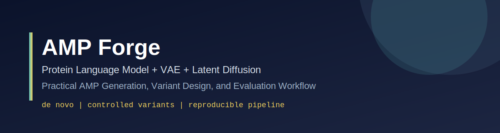
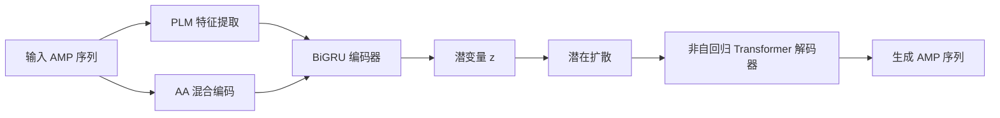

[English](./README.md) | [简体中文](./README.zh-CN.md)

<p align="center">
  
</p>

# AMP Forge

[](./esm_diffvae/requirements.txt)
[](./frontend/package.json)
[](./frontend/package.json)
[](https://unumbrela.github.io/AMP-Forge/)

AMP Forge 是一个面向抗菌肽（AMP）生成的项目与展示仓库，目标是构建可落地、可扩展的完整流程，覆盖：

- 从头（de novo）AMP 生成，
- 基于母序列的可控变体设计，
- 训练与评估脚本化复现。

## 在线演示

- 仓库地址：[https://github.com/unumbrela/AMP-Forge](https://github.com/unumbrela/AMP-Forge)
- 项目页面：[https://unumbrela.github.io/AMP-Forge/](https://unumbrela.github.io/AMP-Forge/)

## 快速入口

- 项目总览：[PROJECT_SUMMARY.md](./PROJECT_SUMMARY.md)
- 数据构建报告：[DATA_COLLECTION_REPORT.md](./DATA_COLLECTION_REPORT.md)
- 核心模型目录：[esm_diffvae/](./esm_diffvae)
- 前端目录：[frontend/](./frontend)

## 核心特性

- 统一架构：PLM 表征 + VAE + 潜在扩散。
- 非自回归解码：并行生成序列位点。
- 条件变体模式：`mixed`、`c_sub`、`c_ext`、`c_trunc`、`tag`、`latent`。
- 数据、训练、生成、评估全流程脚本。


## 架构



## 仓库结构

```text
.
├── esm_diffvae/            # 核心模型、数据、训练、生成、评估
├── frontend/               # GitHub Pages 前端展示
├── PROJECT_SUMMARY.md      # 技术细节总结
├── DATA_COLLECTION_REPORT.md
└── docs/                   # 双语文档与资源
```

## 快速开始

### 1) 核心环境

```bash
cd esm_diffvae
pip install -r requirements.txt
```

### 2) 数据流程（如已有处理后数据可跳过）

```bash
cd esm_diffvae
python data/crawl/parse_local_sources.py
python data/crawl/crawl_dramp.py
python data/crawl/crawl_uniprot.py
python data/crawl/merge_and_clean.py
python data/compute_embeddings.py --backend prot_t5 --model prot_t5_xl_half
```

### 3) 训练流程

```bash
cd esm_diffvae
python training/train_vae.py --config configs/default.yaml
python training/train_vae_rl.py --config configs/default.yaml --vae-checkpoint checkpoints/vae_best.pt
python training/train_diffusion.py --config configs/default.yaml --vae-checkpoint checkpoints/vae_best_recon.pt
```

### 4) 生成

无条件生成：

```bash
cd esm_diffvae
python generation/unconditional.py \
  --config configs/default.yaml \
  --checkpoint checkpoints/esm_diffvae_full.pt \
  --n-samples 100 \
  --top-p 0.9
```

变体生成：

```bash
cd esm_diffvae
python generation/variant.py \
  --config configs/default.yaml \
  --checkpoint checkpoints/esm_diffvae_full.pt \
  --input-sequence "GIGKFLHSAKKFGKAFVGEIMNS" \
  --mode mixed \
  --n-variants 50
```

潜空间插值：

```bash
cd esm_diffvae
python generation/interpolation.py \
  --config configs/default.yaml \
  --checkpoint checkpoints/esm_diffvae_full.pt \
  --seq-a "GIGKFLHSAKKFGKAFVGEIMNS" \
  --seq-b "ILPWKWPWWPWRR" \
  --n-steps 10
```

### 5) 评估

```bash
cd esm_diffvae
python evaluation/run_evaluation.py \
  --config configs/default.yaml \
  --checkpoint checkpoints/esm_diffvae_full.pt
```

### 6) 前端

```bash
cd frontend
pnpm install
pnpm dev
```

## 扩展文档

- 中文：[docs/zh/quickstart.md](./docs/zh/quickstart.md)
- 中文：[docs/zh/training.md](./docs/zh/training.md)
- 中文：[docs/zh/generation.md](./docs/zh/generation.md)
- 中文：[docs/zh/evaluation.md](./docs/zh/evaluation.md)
- 中文：[docs/zh/data-pipeline.md](./docs/zh/data-pipeline.md)
